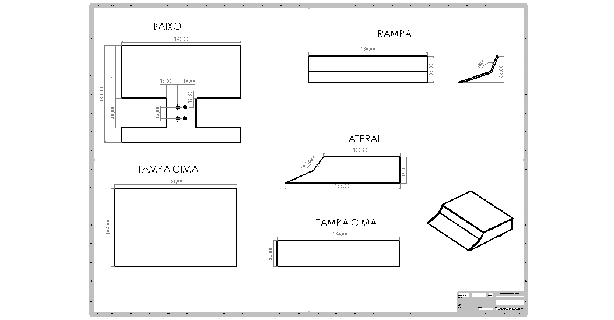
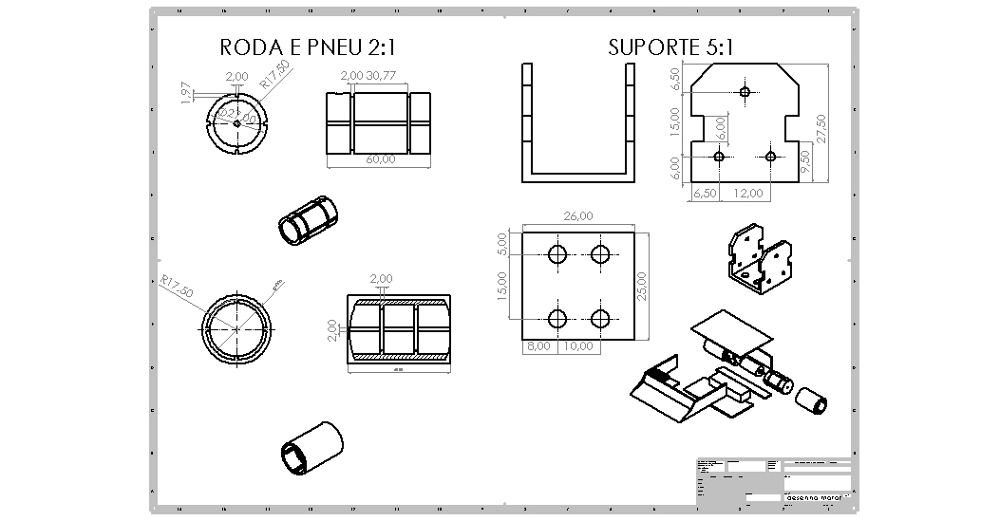
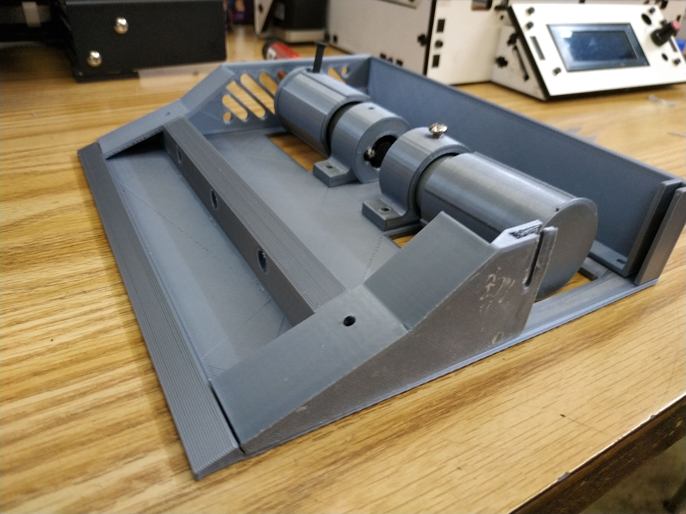

# Cacildinho

Robô sumo 1 kg , esta sendo criado  para a competição da Winter challenge  e vem sofrendo constantes melhorias dês da sua primeira versão. Seu "Retrofit" foi basicamente na parte elétrica e mecânica e esta na atual situação.

### Desenho das partes externas

### Desenho de vistas internas

### Atual situação

